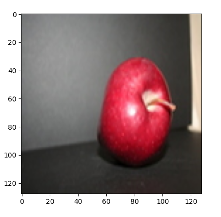
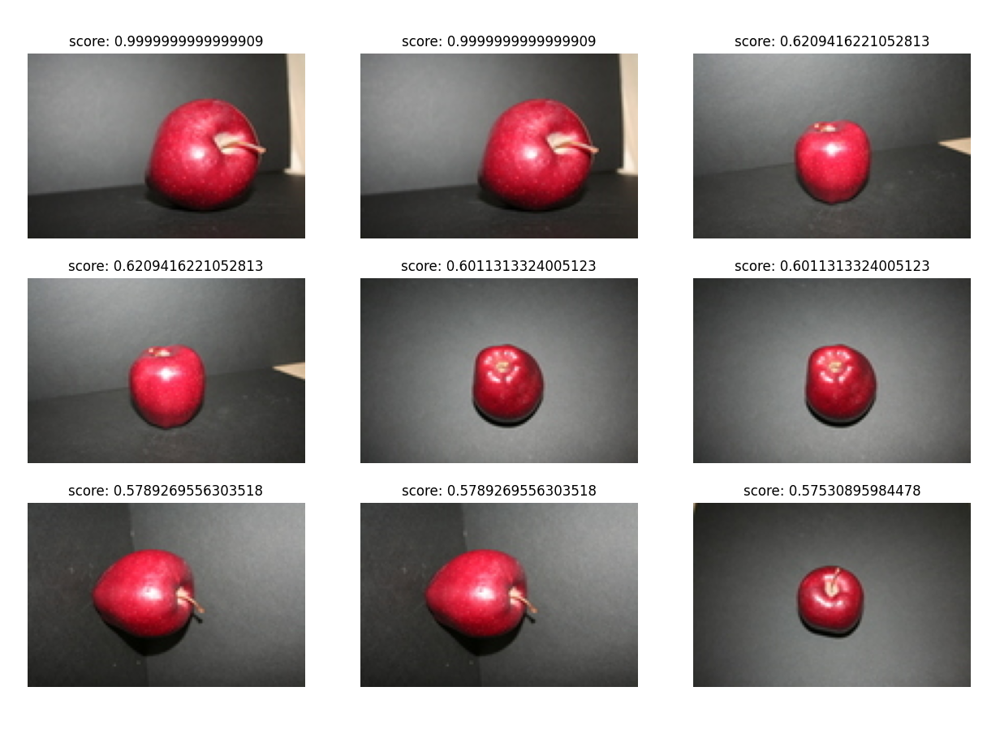

## Project-Image-Retrieval-2022
Image Retrieval Using Distance and CNN + Distance

## Introduce
This repository prodiced with purpose retrieval image in the database based original distance and CNN + original distance
* l1 (absoluta difference)
* l2 (mean square error difference)
* cosine similarity distance
* correlation cofficient distance

## How to run
```
git clone https://github.com/TieuDiem/Project-Image-Retrieval-2022.git
```

# Prepare Data
* Uncomment this line in file main.py
 ```
 _  = PrepareData()()
 ```
 * Query Image in Database
 ```
 _  = QueryExe(query_mode=1 ,root_img_path =root_img_path, query_path =query_path,distance ="l1",first_run =False)()                                            
 ```
 ```latex
 query_mode: =1 if you want to query with original distace, =2 if you want to query with feature(CNN) + original distance
 root_img_path: path of image Database
 query_path: path query image
 distance: distance you want to calculate
 first_run: = True when first time we extract feature and save to disk, = False when you want to load feature file 
 ```
 # Result
 
 <div align ="center">
  <p>
 </img>
 </img>
 </p>
 </div>
 
 
 
 
